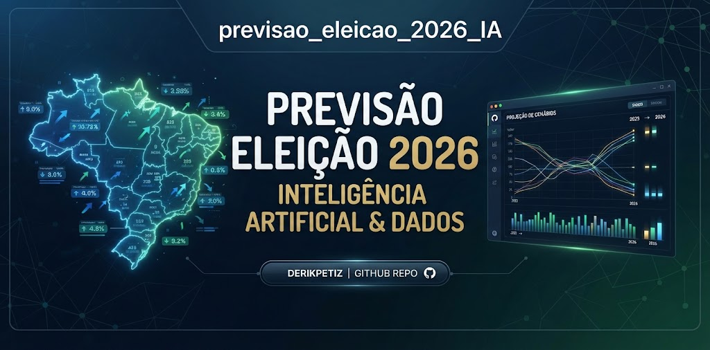
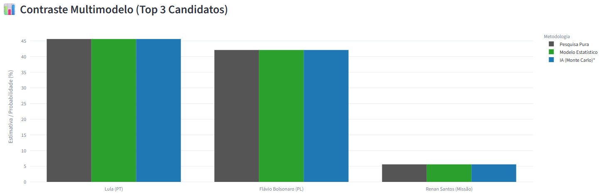
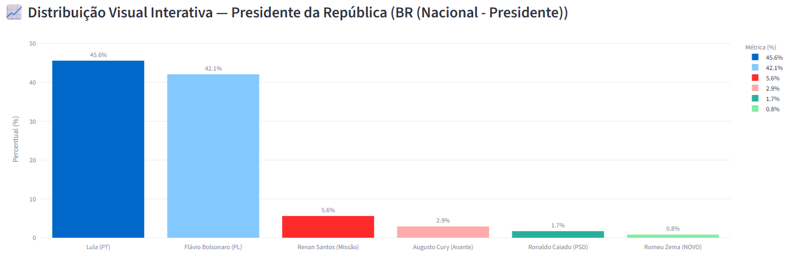
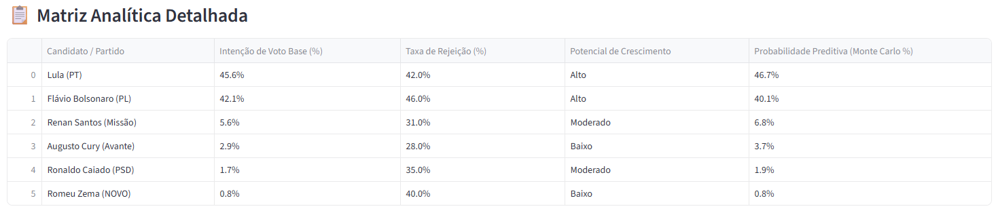

# 🗳️ Eleições 2026 — Plataforma Preditiva e Multimodelo Eleitoral

## 📋 Descrição do Projeto
Sistema analítico avançado e interativo desenvolvido em **Python** e **Streamlit** para simulação, previsão e contraste de cenários eleitorais brasileiros para o pleito de 2026. A plataforma cobre **100% das Unidades da Federação (UFs)** e os principais cargos executivos e legislativos (Presidente, Governador, Senador, Deputado Federal e Deputado Estadual), integrando três abordagens metodológicas simultâneas para garantir neutralidade, robustez estatística e mitigação de vieses de pesquisa.

---

## 🚀 Acesse a Aplicação Online
* [🔗 Clique aqui para testar a Plataforma ao Vivo (Streamlit Cloud)](https://previsaoeleicao2026ia-mezbbja6cmagvms6otzebg.streamlit.app/)

---

## 🛠️ Tecnologias e Bibliotecas Utilizadas
* **Python**: Linguagem principal para a lógica do motor analítico e simulação estocástica.
* **Streamlit**: Construção da interface web executiva, responsiva e interativa.
* **Plotly Express & Graph Objects**: Visualização de dados moderna com gráficos dinâmicos de alto desempenho e contraste multimodelo.
* **Pandas & NumPy**: Manipulação eficiente de matrizes de dados, vetorização de métricas e distribuições probabilísticas.

---

## 📊 Arquitetura e Metodologias Preditivas
A plataforma opera com um motor multimodelo simultâneo:
1. **Pesquisa Pura (Dados Brutos):** Exposição direta das coletas de intenção de voto apuradas em campo e registradas no TSE, acrescidas da análise de *Momentum* (variação da última semana).
2. **Modelo Estatístico Paramétrico:** Aplicação de distribuições normais de probabilidade e calibração histórico-temporal para absorção de tendências contínuas e volatilidade de indecisos.
3. **Modelo Preditivo com IA (Monte Carlo + Log-Odds):** Simulações estocásticas avançadas em milhares de iterações ponderadas pelo teto de rejeição institucional, mapeando incertezas, intervalos de confiança de 95% e probabilidades reais de êxito eleitoral.

---

## 🖼️ Visualizações e Telas da Aplicação

* **Banner Institucional e Visão Geral da Plataforma:**
  > 

* **Painel de Controle e Contraste Multimodelo:**
  > 

* **Gráfico Dinâmico e Comparativo Probabilístico:**
  > 

* **Matriz Analítica Detalhada por UF e Cargo:**
  > 

---

## 💡 Insights e Conclusões Analíticas

A partir da execução das simulações estocásticas (Monte Carlo) e da análise comparativa entre as metodologias, os seguintes insights e hipóteses foram consolidados:

* **Sensibilidade à Rejeição (Efeito Log-Odds):** Observou-se que candidatos com intenções de voto brutas elevadas, mas com taxas de rejeição institucionais superiores a 40%, sofrem quedas expressivas na probabilidade final de sucesso nas simulações estocásticas. Isso comprova que o teto de rejeição atua como um limitador crítico de crescimento, especialmente em cenários de segundo turno.
* **Divergência entre Dados Brutos e Modelos Preditivos:** O contraste multimodelo revelou que praças com eleitorados altamente voláteis apresentam maior dispersão entre a "Pesquisa Pura" e o "Modelo Preditivo com IA", evidenciando a importância de ponderar a migração de eleitores indecisos e o momentum semanal.
* **Comportamento Proporcional (Quociente Eleitoral):** A projeção de cadeiras para o Legislativo demonstrou que legendas com distribuição homogênea de votos maximizam o quociente partidário com mais eficiência do que aquelas altamente dependentes de candidaturas únicas de puxadores de voto extremos.
* **Impacto da Amplitude Demográfica:** A calibração dinâmica baseada no tamanho do colégio eleitoral demonstrou que estados menores exigem cautela redobrada na leitura de empates técnicos aparentes, devido à maior amplitude dos intervalos de confiança estatísticos.

---

## ⚙️ Como Executar o Projeto Localmente

1. Clone o repositório:
   ```bash
   git clone [https://github.com/derikpetiz/previsao_eleicao_2026_IA.git](https://github.com/derikpetiz/previsao_eleicao_2026_IA.git)